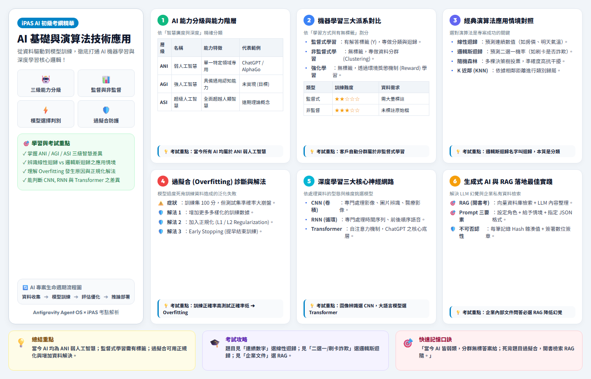

# 🎴 iPAS AI 應用規劃師（初級）高密度考點圖卡線上學習庫

> 🚀 **零基礎友善・一卡一重點・生活化比喻・Bento Grid 視覺圖卡・GitHub Pages 一鍵即用**

[](https://etrnya.github.io/ipas-ai-flashcards/)
[](https://creativecommons.org/licenses/by-nc-sa/4.0/deed.zh-hant)
[](https://www.ipas.org.tw/)

---

## 💡 專案簡介 (About The Project)

本專案專為準備經濟部 **iPAS AI 應用規劃師（初級）能力鑑定** 所設計。

針對 237 頁官方考綱教科書，透過 **Antigravity Agent OS** 進行語意提煉與 **現代前端 HTML5/CSS3 Bento Grid** 視覺設計，將龐雜的 AI 學理精煉為 **22 張「一卡一重點」高資訊密度圖卡**。

無論您是否有技術背景，都能透過生活化比喻、對比矩陣表格、秒解關鍵字與記憶口訣，在手機、平板或電腦上輕鬆刷題複習！

---

## ✨ 核心特色 (Key Features)

- 📱 **Mobile-First 響應式 App (RWD)**：支援手機、平板與電腦自適應，隨時隨地開啟網址即可刷題。
- 💡 **零基礎直覺比喻**：拋棄抽象數學公式，使用「果汁機 vs 特級廚師」、「開書考 vs 閉卷考」等生活故事秒懂 AI。
- 🎯 **考試秒解關鍵字**：每張圖卡標註歷屆試題關鍵字與陷阱題解法，現學現賣。
- 🔍 **即時搜尋與分類過濾**：內建全文字搜尋（如 `RAG`, `Overfitting`, `SVM`）與 7 大考綱單元過濾。
- 📷 **內建 2K 高清 PNG 產出**：提供完整 22 張圖卡高清圖片包，可直接下載存入手機相簿。

---

## 🖼️ 圖卡視覺預覽 (Flashcard Preview)

<div align="center">
  
  <p><i>▲ 白底清爽高密度 Bento Grid 圖卡範例（CARD 01 - AI 基礎與演算法）</i></p>
</div>

---

## 🗺️ 22 張考點精華圖卡地圖 (Flashcard Map)

### 📘 科目一：L11 人工智慧基礎概論 (13 張)
- [x] **CARD 01**：AI 的定義、驅動因素與三級能力分級 (ANI / AGI / ASI)
- [x] **CARD 02**：AI 發展演進史、圖靈測試、中文房間與黃仁勳 4 階段論
- [x] **CARD 03**：AI 三大核心子技術 (CV / NLP / ASR) 與多模態 CLIP
- [x] **CARD 04**：機器學習三大學習派系 (監督 / 非監督 / 強化學習)
- [x] **CARD 05**：經典演算法對照 (線性迴歸 / 邏輯斯 / 隨機森林 / SVM / KNN)
- [x] **CARD 06**：資料預處理與特徵工程 (缺失值 / 離群值 / One-Hot / Scaling)
- [x] **CARD 07**：過擬合 (Overfitting) 與欠擬合診斷 (L1 Lasso / L2 Ridge / K-Fold)
- [x] **CARD 08**：神經網絡基礎 (感知器 / ReLU / 損失函數 / BP 連鎖律)
- [x] **CARD 09**：深度學習三大核心模型 (CNN 圖像 / RNN 序列 / Transformer 注意力)
- [x] **CARD 10**：模型評估指標矩陣 (混淆矩陣 / Precision / Recall / F1 / ROC-AUC)
- [x] **CARD 11**：AI 倫理五大原則、演算法偏見與可解釋性 AI (XAI)
- [x] **CARD 12**：資安防禦與不可否認性 (加密雜湊 Hash + 數位簽章 + 聯邦學習)
- [x] **CARD 13**：台灣 AI 基本法、行政院 GenAI 指引與歐盟 AI 法案

### 📙 科目二：L12 生成式 AI 應用與規劃 (9 張)
- [x] **CARD 14**：大語言模型 (LLM) 底層機制、Context Window 與幻覺治理
- [x] **CARD 15**：提示工程 (Prompt) 技巧 (Few-Shot / 思維鏈 CoT / ReAct 框架)
- [x] **CARD 16**：RAG (檢索增強生成) 完整架構、Chunking 切塊與向量資料庫
- [x] **CARD 17**：Prompt vs RAG vs Fine-tuning 技術選型決策樹與 LoRA
- [x] **CARD 18**：企業 AI 專案五大生命週期 (PoC 驗證 / MLOps / 模型漂移)
- [x] **CARD 19**：AI 專案範疇界定與可行性評估 (技術 / 經濟 / 營運 / Make or Buy)
- [x] **CARD 20**：製造業 (AOI/預測維護)、金融業 (風控) 與醫療業 (SaMD) 導入指引
- [x] **CARD 21**：生成式 AI 工具分類 (LLM / Diffusion 擴散模型 / Copilot)
- [x] **CARD 22**：企業資安防護、影子 AI 治理與個資去識別化 (PII / SPII / Masking)

---

## 🛠️ 開發與本地執行 (Local Development)

若您想在本地執行或重新產出 PNG 圖卡：

```bash
# 1. 克隆專案
git clone https://github.com/etrnya/ipas-ai-flashcards.git
cd ipas-ai-flashcards

# 2. 安裝必要 Python 依賴 (Playwright 渲染)
pip install playwright markitdown
playwright install chromium

# 3. 重新渲染 22 張高清 PNG 圖卡
python render_all_22_png.py
```

直接在瀏覽器開啟 `index.html` 即可進行本地端體驗。

---

## 📜 授權與免責聲明 (License & Disclaimer)

- **作者資訊**：整理自【唐門企鵝 DonmenKir】考綱教材與 iPAS 官方試題。
- **授權條款**：本專案歸納框架、Bento Grid 模板與圖卡內容採用 **[創用 CC 姓名標示-非商業性-相同方式分享 4.0 國際 (CC BY-NC-SA 4.0)](https://creativecommons.org/licenses/by-nc-sa/4.0/deed.zh-hant)** 授權釋出。
- **非營利聲明**：本專案為個人備考與開源學習之用，免費公開無廣告，非以營利為目的。

---

<div align="center">
  <b>⭐ 如果這個專案對您的 iPAS 備考有幫助，歡迎點擊右上角 Star 给予支持！⭐</b>
</div>
